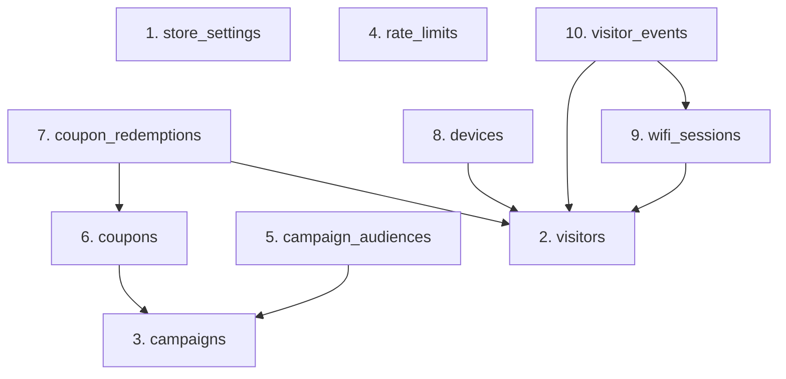

# 04_data_export_plan.md - Plano de Exportação e Importação de Dados (Revisado)

Este plano define a estratégia de extração e carga de dados das 10 tabelas do sistema Wi-Fi Marketing, mantendo todas as constraints de integridade referencial ativas e respeitando a ordem correta de dependência de chaves estrangeiras.

---

## 1. Ordem de Importação (Constraints 100% Ativas)

Como o uso de desativação global de restrições por tabela (`session_replication_role = replica` ou similar) está proibido nesta migração, a importação dos dados ocorrerá de forma sequencial estrita, onde as tabelas pai (referenciadas) são carregadas antes das tabelas filho (dependentes).



### Sequência Sequencial de Execução de Importação:
1. **`public.store_settings`** (Nenhuma dependência)
2. **`public.visitors`** (Nenhuma dependência)
3. **`public.campaigns`** (Nenhuma dependência)
4. **`public.rate_limits`** (Nenhuma dependência)
5. **`public.campaign_audiences`** (Chave estrangeira para `campaigns` com constraint ativa)
6. **`public.coupons`** (Chave estrangeira para `campaigns` com constraint ativa)
7. **`public.coupon_redemptions`** (Chaves estrangeiras para `coupons` e `visitors` com constraints ativas)
8. **`public.devices`** (Chave estrangeira para `visitors` com constraint ativa)
9. **`public.wifi_sessions`** (Chave estrangeira para `visitors` com constraint ativa)
10. **`public.visitor_events`** (Chaves estrangeiras para `visitors` e `wifi_sessions` com constraints ativas)

---

## 2. Roteiro de Execução de Carga de Dados

### Passo 2.1 - Exportação de Dados do Banco Compartilhado (Origem)
Utilizar a CLI local `pg_dump` para gerar um arquivo contendo apenas instruções `INSERT` dos dados das tabelas, preservando os UUIDs primários:

```bash
pg_dump -h db.vjwehthlyldrpvdnjpca.supabase.co -U postgres -d postgres \
  --data-only --inserts --column-inserts \
  -t store_settings \
  -t visitors \
  -t campaigns \
  -t rate_limits \
  -t campaign_audiences \
  -t coupons \
  -t coupon_redemptions \
  -t devices \
  -t wifi_sessions \
  -t visitor_events \
  -f wifi_marketing_data_inserts.sql
```

*Nota: A flag `--column-inserts` garante que o nome de cada coluna seja explícito no script SQL de insert, facilitando validações de schema e prevenindo erros caso a ordem física de colunas mude no destino.*

### Passo 2.2 - Preparação do Arquivo SQL de Dados
O arquivo `wifi_marketing_data_inserts.sql` gerado pelo `pg_dump` organiza os inserts por blocos de tabela. **Certifique-se manualmente** de que a ordem física de blocos de `INSERT` no arquivo gerado siga exatamente a ordem sequencial descrita na seção 1 deste plano (pai antes de filho).

### Passo 2.3 - Importação de Dados no Banco Novo (Destino)
Execute a importação conectando-se diretamente ao novo projeto Supabase exclusivo via CLI `psql` com todas as chaves estrangeiras e restrições ativadas:

```bash
psql -h db.[NOVO_PROJECT_ID].supabase.co -U postgres -d postgres -f wifi_marketing_data_inserts.sql
```
*(Será solicitada a senha da conta administrativa do novo projeto Supabase).*
