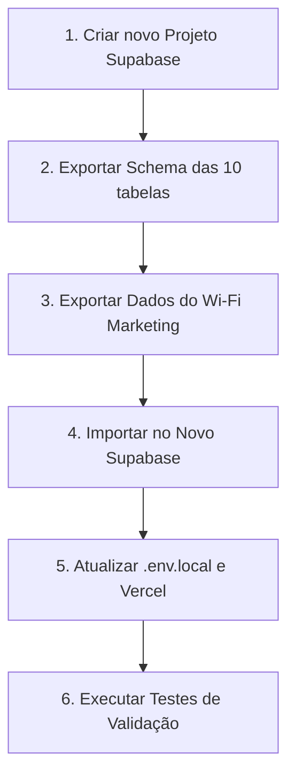

# Relatório Técnico de Auditoria de Banco de Dados Remoto (Supabase)

---

## 1. Origem da Conexão e Compartilhamento de Banco

### 1.1 Por que o Wi-Fi Marketing está usando o projeto `ai-employees-dev`?
* **Classificação**: **Confirmado (Ambiente Compartilhado)**
* **Arquivo e Linha Analisados**: `.env.local` (Linhas 2–4)
* **Evidência**:
  ```env
  NEXT_PUBLIC_SUPABASE_URL=https://vjwehthlyldrpvdnjpca.supabase.co
  ```
* **Consulta Supabase Management API (`list_projects`)**:
  ```json
  {
    "id": "vjwehthlyldrpvdnjpca",
    "name": "ai-employees-dev",
    "organization_id": "cldcqdgcurzvhydafiwt",
    "created_at": "2026-07-30T23:21:14Z"
  }
  ```
* **Diagnóstico**: Durante a fase inicial de desenvolvimento do Wi-Fi Marketing, o projeto reutilizou as credenciais de um projeto Supabase pré-existente (`ai-employees-dev`, criado em 30/07/2026 para uma plataforma SaaS/Prisma). As tabelas do Wi-Fi Marketing foram criadas no mesmo schema `public` de outro sistema.
* **Risco**: **ALTO (Vazamento de Escopo e Colisão de Dados)**. Misturar dados de dois sistemas em um único projeto Supabase expõe credenciais, dificulta backups isolados e aumenta o risco de alterações de schema impactarem aplicações distintas.

---

## 2. Segregação de Tabelas no Schema `public`

O schema `public` da instância remota contém **24 tabelas no total**, divididas entre os dois sistemas:

### 2.1 Tabelas do Sistema Wi-Fi Marketing (10 tabelas)
1. `public.store_settings`
2. `public.visitors`
3. `public.devices`
4. `public.wifi_sessions`
5. `public.campaigns`
6. `public.campaign_audiences`
7. `public.coupons` *(Legado inativo)*
8. `public.coupon_redemptions` *(Legado inativo)*
9. `public.visitor_events`
10. `public.rate_limits`

### 2.2 Tabelas do Outro Sistema (`ai-employees-dev` - 14 tabelas)
1. `public._prisma_migrations` *(Histórico do Prisma ORM)*
2. `public.organizations` *(Entidade Multi-tenant)*
3. `public.users` *(Contas de usuários do SaaS)*
4. `public.memberships`
5. `public.roles`
6. `public.permissions`
7. `public.role_permissions`
8. `public.membership_roles`
9. `public.refresh_tokens` *(Tokens de sessão)*
10. `public.audit_logs`
11. `public.outbox_events`
12. `public.inbox_events`
13. `public.usage_records`
14. `public.idempotency_records`

---

## 3. Análise de Migrations (Locais vs. Remotas)

### 3.1 Migrations no Repositório (`supabase/migrations/`)
* Total: **9 arquivos de migração**.
  1. `20260803_initial_schema.sql`
  2. `20260803_visitor_journey.sql`
  3. `20260804_add_campaign_system.sql`
  4. `20260804_add_visitor_events_table.sql`
  5. `20260804_add_rate_limit_table.sql`
  6. `20260804_add_missing_fields.sql`
  7. `20260804_visitor_journey_post_signup.sql`
  8. `20260804_portal_media_and_banner.sql`
  9. `20260804_add_analytics_indices.sql`

### 3.2 Migrations Registradas no Supabase Remoto
* **Consulta Executada (`list_migrations`)**:
  ```json
  [
    {"version": "20260804162951", "name": "20260804_add_campaign_system"},
    {"version": "20260804163050", "name": "20260804_add_visitor_events_table"},
    {"version": "20260804163103", "name": "20260804_add_rate_limit_table"}
  ]
  ```

### 3.3 Diagnóstico de Divergência
* **Apenas 3 migrations estão registradas no histórico oficial de migração do Supabase**.
* As migrations iniciais (`20260803_initial_schema.sql`, etc.) e os ajustes de colunas foram aplicados manualmente via SQL Editor ou scripts sem registrar versão na tabela `schema_migrations`.
* **Migration Pendente de Otimização**: A migração `20260804_add_analytics_indices.sql` **NÃO FOI APLICADA** no banco remoto.
* **Evidência no Banco Remoto (`pg_indexes`)**:
  Ao consultar `SELECT indexname FROM pg_indexes WHERE tablename = 'visitor_events';`, os índices compostos de Analytics (`idx_visitor_events_type_created_at`, `idx_visitor_events_campaign_type_created_at`, `idx_visitor_events_visitor_created_at`) **NÃO existem no banco de dados remoto**.

---

## 4. Análise Detalhada das 4 Tabelas Sem RLS

> [!WARNING]
> RLS **NÃO** foi habilitado automaticamente nesta verificação. Abaixo estão as permissões atuais, riscos e políticas necessárias antes de qualquer intervenção.

### 4.1 `public.users`
* **Quem usa**: Plataforma `ai-employees-dev`.
* **Permissões Atuais**: `rls_enabled: false`. Acesso público total (SELECT, INSERT, UPDATE, DELETE) para a role `anon` via cliente API do Supabase.
* **Conteúdo Sensível**: Contém colunas `email`, `display_name`, `password_hash`, `status`.
* **Risco**: **CRÍTICO**. Qualquer pessoa com a `NEXT_PUBLIC_SUPABASE_ANON_KEY` pode consultar as contas e hashes de senhas dos usuários.
* **Políticas Necessárias antes de ativar RLS**:
  ```sql
  ALTER TABLE public.users ENABLE ROW LEVEL SECURITY;
  
  -- Permite que usuários autenticados vejam/editem apenas seu próprio perfil
  CREATE POLICY "Users can view own profile" 
    ON public.users FOR SELECT TO authenticated 
    USING (auth.uid() = id);

  -- Acesso total administrativo apenas via service_role
  ```

### 4.2 `public.refresh_tokens`
* **Quem usa**: Sistema de autenticação da plataforma `ai-employees-dev`.
* **Permissões Atuais**: `rls_enabled: false`. Leitura e modificação públicas irrestritas.
* **Conteúdo Sensível**: Hashes de tokens de sessão, IP e User-Agent.
* **Risco**: **CRÍTICO**. Expõe hashes de tokens ativos, permitindo sequestro de sessão (session hijacking).
* **Políticas Necessárias antes de ativar RLS**:
  ```sql
  ALTER TABLE public.refresh_tokens ENABLE ROW LEVEL SECURITY;
  
  -- Nenhuma política pública/anon/authenticated. Acesso exclusivo para a service_role.
  ```

### 4.3 `public._prisma_migrations`
* **Quem usa**: Engine do Prisma ORM (`ai-employees-dev`).
* **Permissões Atuais**: `rls_enabled: false`. Leitura pública irrestrita.
* **Conteúdo Sensível**: Nomes de migrações, checksums e logs de alteração de estrutura.
* **Risco**: **MÉDIO**. Revela o histórico de mudanças do banco de dados para potenciais atacantes.
* **Políticas Necessárias antes de ativar RLS**:
  ```sql
  ALTER TABLE public._prisma_migrations ENABLE ROW LEVEL SECURITY;
  
  -- Nenhuma política pública. Acesso exclusivo para a service_role e migrações CLI.
  ```

### 4.4 `public.permissions`
* **Quem usa**: Módulo de RBAC da plataforma `ai-employees-dev`.
* **Permissões Atuais**: `rls_enabled: false`. Leitura pública irrestrita.
* **Conteúdo Sensível**: Códigos de permissão e classes de risco do sistema.
* **Risco**: **MÉDIO**. Expõe o mapa funcional e permissões internas da aplicação.
* **Políticas Necessárias antes de ativar RLS**:
  ```sql
  ALTER TABLE public.permissions ENABLE ROW LEVEL SECURITY;
  
  -- Leitura apenas para usuários autenticados da plataforma
  CREATE POLICY "Authenticated users can read permissions" 
    ON public.permissions FOR SELECT TO authenticated 
    USING (true);
  ```

---

## 5. Preparação da Migration de Índices (Fase C + Foreign Key)

> [!NOTE]
> Esta migration foi apenas **gerada em texto** conforme solicitado e **NÃO FOI EXECUTADA OU SALVA EM DISCO**.

```sql
-- Arquivo sugerido: supabase/migrations/20260804_add_analytics_indices_v2.sql
-- Descrição: Otimização de consultas para a Fase C (Analytics) e correção de FK unindexed

-- 1. Índice ausente de Foreign Key em devices (Alerta de Performance do Supabase Advisor)
CREATE INDEX IF NOT EXISTS idx_devices_visitor_id
  ON public.devices(visitor_id);

-- 2. Índices compostos essenciais para buscas temporais de Analytics (Fase C)
CREATE INDEX IF NOT EXISTS idx_visitor_events_type_created_at
  ON public.visitor_events(event_type, created_at);

CREATE INDEX IF NOT EXISTS idx_visitor_events_campaign_type_created_at
  ON public.visitor_events(campaign_id, event_type, created_at);

CREATE INDEX IF NOT EXISTS idx_visitor_events_visitor_created_at
  ON public.visitor_events(visitor_id, created_at);
```

---

## 6. Plano de Migração para Supabase Exclusivo (Sem Perda de Dados)

Para isolar o **Wi-Fi Marketing** em uma instância limpa e dedicada sem afetar o projeto `ai-employees-dev`:



### Etapas Detalhadas:

1. **Criar Projeto Dedicado**:
   * Criar um novo projeto no painel do Supabase com o nome `wifi-marketing-prod` na região `sa-east-1` (São Paulo).

2. **Exportar Schema Filtrado**:
   * Gerar o script DDL contendo **apenas** as 10 tabelas do Wi-Fi Marketing (`store_settings`, `visitors`, `devices`, `wifi_sessions`, `campaigns`, `campaign_audiences`, `coupons`, `coupon_redemptions`, `visitor_events`, `rate_limits`), suas PKs, FKs, RLS e índices.

3. **Exportar Dados Existentes**:
   * Executar dump de dados em formato SQL INSERT ou CSV exclusivamente das 10 tabelas do Wi-Fi Marketing do projeto `vjwehthlyldrpvdnjpca`.

4. **Importação e Otimização**:
   * Executar o DDL e a carga de dados no novo Supabase.
   * Aplicar a migração de índices da Fase C (`20260804_add_analytics_indices_v2.sql`).

5. **Atualização de Variáveis de Ambiente**:
   * Atualizar `.env.local` e as variáveis no painel da Vercel com a nova `NEXT_PUBLIC_SUPABASE_URL`, `NEXT_PUBLIC_SUPABASE_ANON_KEY` e `SUPABASE_SERVICE_ROLE_KEY`.

6. **Validação**:
   * Executar a suíte de testes unitários/integração (`npm test -- --run`) garantindo 100% de aprovação antes da virada oficial.

---

## 7. Matriz de Status Atualizada (Baseada no Banco Remoto Real)

| Item | Status | Evidência Analisada | Risco | Prioridade |
| :--- | :--- | :--- | :--- | :--- |
| **Isolamento de Banco** | **Não Conforme** | URL aponta para projeto `ai-employees-dev` que contém 14 tabelas externas | Alto | P1 |
| **RLS das Tabelas do Wi-Fi Marketing** | **Confirmado** | As 10 tabelas da aplicação possuem RLS ativado | Baixo | P3 |
| **RLS das Tabelas Externas (`users`, etc.)** | **Crítico** | `users`, `refresh_tokens`, `permissions` e `_prisma_migrations` estão sem RLS | Crítico | P1 |
| **Índices da Fase C (Analytics)** | **Pendente** | `pg_indexes` remoto confirmou ausência dos índices compostos em `visitor_events` | Alto | P1 |
| **Índice de FK `devices.visitor_id`** | **Pendente** | Identificado como ausente pelo Performance Advisor do Supabase | Médio | P2 |
| **Suíte de Testes Automatizados** | **Passando** | 68 de 68 testes aprovados localmente (`vitest`) | Baixo | P3 |
| **Build de Produção Next.js** | **Passando** | `npm run build` gerou as 19 rotas com Turbopack sem erros de compilação | Baixo | P3 |

---

## 8. Resposta Final aos Critérios de Prontidão

* **Pronto para demonstração online?** 
  * **SIM**. O portal do visitante e o painel de estatísticas funcionam em modo de demonstração ou integrados ao banco atual para fins de apresentação de layout e navegação.
* **Pronto para piloto com roteador?** 
  * **NÃO**. O envio da autorização em `success-offer.tsx` utiliza `mode: 'no-cors'`, o que não permite ao portal ler a resposta HTTP do roteador para confirmar a liberação real da rede.
* **Pronto para cliente pagante?** 
  * **NÃO**. É necessário migrar os dados para um Supabase exclusivo, corrigir a falta de RLS nas tabelas do banco compartilhado e aplicar os índices de performance da Fase C.
* **Pronto para múltiplos restaurantes?** 
  * **NÃO**. A arquitetura atual armazena as configurações de um único estabelecimento (`store_settings`), exigindo evolução do modelo de dados para suportar Multi-tenant.
