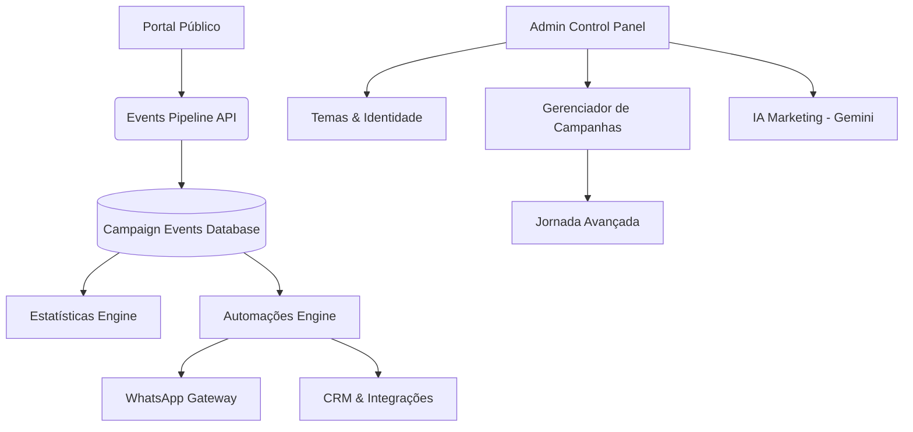

# Plano de Evolução da Plataforma de Relacionamento Wi-Fi Marketing

Este plano detalha a estratégia de transformação do sistema de Wi-Fi Marketing atual em uma plataforma completa de relacionamento com visitantes. Ele aborda o estado atual, a arquitetura futura, a modelagem de banco de dados, a especificação do pipeline de eventos, o plano de implementação em fases, as regras de segurança e a matriz de priorização.

---

## 1. Estado Atual

### Funcionalidades Existentes
- **Identificação de Visitantes**: Cadastro com validação de telefone (WhatsApp) e campos opcionais dinâmicos (e-mail, data de nascimento, cidade, gênero).
- **Visitantes Recorrentes**: Reconhecimento inteligente baseado em endereço MAC ou Cookies com validação do período de re-cadastro (relogin interval).
- **Ações Pós-Cadastro (Tela de Sucesso)**: Exibição de cupons, redirecionamentos automáticos ou sob clique, imagens promocionais e banners.
- **Engajamento Social**: Links configuráveis para Instagram, Cardápio Digital e Avaliação no Google.
- **Painel Administrativo**: Autenticação via Supabase Auth, dashboard básico de conexões por hora de pico, e gerência de dados de contato (visitantes).
- **Segurança e Estabilidade**: Rate limiting em memória e persistente em banco de dados por IP (tabela `rate_limits`). Proteção robusta contra redirecionamentos nulos.

### Tabelas Atuais
- `store_settings`: Configurações de marca, temas, termos, campos dinâmicos, comportamentos pré e pós-cadastro.
- `visitors`: Dados cadastrais e contadores de visitas de cada cliente.
- `devices`: Endereços MAC vinculados a cada visitante.
- `wifi_sessions`: Registro de conexões ativas/expiradas vinculadas ao roteador OpenNDS.
- `rate_limits`: Bloqueio de abusos de IPs na API pública.

### APIs Atuais
- `/api/portal/register`: Rota segura de criação de visitantes usando chave administrativa exclusivamente no servidor.
- `/api/portal/check-mac`: Verificação rápida do status do dispositivo do visitante.
- `/api/portal/settings`: Retorno público de dados visuais do portal.
- `/api/admin/settings`: Manipulação de dados de jornada e marca (exige login).

### Componentes Atuais
- **Componentes do Portal**: `landing-page.tsx`, `visitor-form.tsx`, `returning-visitor.tsx`, `success-offer.tsx`.
- **Componentes de Admin**: `admin-nav.tsx`, `contact-details-modal.tsx`, `contacts-table.tsx`, `image-uploader.tsx`, `metrics-cards.tsx`, `peak-hours-chart.tsx`, `preview-mobile.tsx`.

### Recursos com Atendimento Parcial aos Novos Módulos
- **Jornada do Visitante**: Já temos controle de passos simples (pré e pós-cadastro) de forma estática no banco.
- **Temas**: Presets visuais em arquivo TypeScript no painel.
- **Estatísticas**: Métricas de visitas brutas e horários estão implementadas no Dashboard de forma simplificada.

### Arquivos Críticos para Refatoração Prévia
- `src/components/admin/preview-mobile.tsx` (15KB): Centraliza toda a visualização simulada do smartphone de forma altamente acoplada. Deve ser dividido em componentes visuais menores por tela de prévia antes de suportar temas e campanhas dinâmicas.
- `src/app/portal/page.tsx`: Controla toda a máquina de estado do portal de login. O acoplamento de estados de redirecionamento, cadastro e verificação de MAC deve ser segmentado antes de expandir para etapas avançadas da jornada de visitante.

---

## 2. Arquitetura Futura

Propõe-se uma arquitetura modular composta por dez módulos interconectados de forma fracamente acoplada:



### Módulos e Componentes

#### A. Dashboard
- **Objetivo**: Fornecer visão consolidade da performance da loja em tempo real.
- **Telas**: Tela principal do admin com widgets de ROI de campanhas, funil de conversão e alertas de automação.
- **APIs**: `/api/admin/dashboard/kpis` (retorno consolidado de dados).
- **Tabelas**: `visitors`, `wifi_sessions`, `campaign_events`.
- **Permissões**: Apenas perfil de Administrador autenticado.
- **Eventos**: Apenas escuta e exibe.
- **Dependências**: Estatísticas.

#### B. Visitantes
- **Objetivo**: Cadastro centralizado, controle de dispositivos e segmentação de audiência.
- **Telas**: Lista de contatos, Ficha de perfil do visitante, Criador de Segmentos (filtros por visitas, idade, gênero, etc.).
- **APIs**: `/api/admin/visitors` (CRUD), `/api/admin/visitors/segments`.
- **Tabelas**: `visitors`, `devices`, `campaign_audiences`.
- **Permissões**: Escrita apenas via API segura de registro no servidor ou Admin logado.
- **Eventos**: `VISITOR_REGISTERED`, `VISITOR_RETURNED`.
- **Dependências**: Nenhuma.

#### C. Campanhas
- **Objetivo**: Exibir ofertas focadas, cupons de desconto dinâmicos ou pesquisas (NPS) no portal.
- **Telas**: Gerenciador de campanhas, Editor de cupons e criativos.
- **APIs**: `/api/admin/campaigns` (CRUD), `/api/portal/campaigns` (exibição de campanhas válidas).
- **Tabelas**: `campaigns`, `campaign_audiences`, `coupons`, `coupon_redemptions`.
- **Permissões**: Leitura anônima limitada aos critérios de público; CRUD exclusivo de admin.
- **Eventos**: `CAMPAIGN_VIEWED`, `CAMPAIGN_CLICKED`, `COUPON_COPIED`, `COUPON_REDEEMED`.
- **Dependências**: Visitantes, Temas.

#### D. Jornada do Visitante
- **Objetivo**: Orquestrar a sequência de telas que o visitante visualiza no portal antes da liberação.
- **Telas**: Editor visual de fluxo de jornada (Passos sequenciais de engajamento).
- **APIs**: `/api/admin/journeys` (CRUD), `/api/portal/journey/next` (cálculo de passo atual).
- **Tabelas**: `visitor_journeys`, `journey_steps`.
- **Permissões**: Admin para configuração; leitura anônima no portal.
- **Eventos**: `PORTAL_VIEWED`, `WIFI_AUTH_SENT`.
- **Dependências**: Visitantes, Campanhas.

#### E. Estatísticas
- **Objetivo**: Agregação analítica rápida de eventos históricos de engajamento.
- **Telas**: Tela de Relatórios Demográficos, Funis de Conversão, Estatísticas de Rede.
- **APIs**: `/api/admin/analytics/reports`.
- **Tabelas**: `campaign_events` (tabela de fatos).
- **Permissões**: Admin autenticado.
- **Eventos**: Escuta todos os eventos de interação.
- **Dependências**: Visitantes, Campanhas.

#### F. Temas
- **Objetivo**: Customização completa de estilos (logos, fontes, CSS customizado, temas sazonais).
- **Telas**: Construtor visual de temas com prévia integrada.
- **APIs**: `/api/admin/themes` (CRUD).
- **Tabelas**: `theme_presets`.
- **Permissões**: Admin para edição; leitura anônima no portal.
- **Eventos**: Nenhum.
- **Dependências**: Nenhuma.

#### G. Automações
- **Objetivo**: Criar gatilhos inteligentes com base no comportamento dos visitantes.
- **Telas**: Criador de Regras (Se [evento] e [condição] então execute [ação]).
- **APIs**: `/api/admin/automations` (CRUD).
- **Tabelas**: `automation_rules`, `automation_executions`.
- **Permissões**: Admin autenticado.
- **Eventos**: Escuta eventos de visitas e cliques; gera disparos automatizados.
- **Dependências**: Visitantes, WhatsApp.

#### H. WhatsApp
- **Objetivo**: Comunicação direta e automatizada por mensagens de WhatsApp.
- **Telas**: Configurações de API Key (Meta Cloud API/Z-API), Editor de Modelos (Templates).
- **APIs**: `/api/admin/whatsapp/templates`, `/api/admin/whatsapp/send`.
- **Tabelas**: `whatsapp_templates`, `whatsapp_messages`.
- **Permissões**: Admin autenticado.
- **Eventos**: `WHATSAPP_SENT`, `WHATSAPP_DELIVERED`, `WHATSAPP_FAILED`.
- **Dependências**: Automações.

#### I. IA Marketing
- **Objetivo**: Redação de ofertas e criativos usando Inteligência Artificial.
- **Telas**: Copiloto integrado nos formulários de texto de campanhas e WhatsApp.
- **APIs**: `/api/admin/ai/generate` (integração segura com Gemini API).
- **Tabelas**: `ai_generations`.
- **Permissões**: Admin autenticado.
- **Eventos**: `AI_GENERATION_CREATED`.
- **Dependências**: Campanhas.

#### J. Integrações
- **Objetivo**: Conectar a leads com CRMs e ferramentas de e-mail marketing (ex: RD Station, ActiveCampaign).
- **Telas**: Configuração de Webhooks e chaves de APIs parceiras.
- **APIs**: `/api/admin/integrations` (CRUD), `/api/webhooks/incoming`.
- **Tabelas**: Configurações adicionais guardadas em `store_settings` de forma estruturada.
- **Permissões**: Admin autenticado.
- **Eventos**: Consome `VISITOR_REGISTERED`.
- **Dependências**: Visitantes.

---

## 3. Modelagem do Banco de Dados

Novas tabelas propostas no banco de dados Supabase (sem interferência direta no schema existente):

```sql
-- Campaigns (Campanhas)
CREATE TABLE IF NOT EXISTS public.campaigns (
  id UUID PRIMARY KEY DEFAULT gen_random_uuid(),
  title VARCHAR(255) NOT NULL,
  description TEXT,
  type VARCHAR(50) NOT NULL, -- 'PROMO', 'COUPON', 'SURVEY', 'BANNER'
  status VARCHAR(20) NOT NULL DEFAULT 'DRAFT', -- 'DRAFT', 'ACTIVE', 'PAUSED', 'EXPIRED'
  media_url TEXT,
  media_type VARCHAR(20) DEFAULT 'IMAGE', -- 'IMAGE', 'VIDEO'
  aspect_ratio VARCHAR(10) DEFAULT '4:5',
  button_text VARCHAR(255),
  button_url TEXT,
  start_date TIMESTAMPTZ,
  end_date TIMESTAMPTZ,
  created_at TIMESTAMPTZ DEFAULT NOW(),
  updated_at TIMESTAMPTZ DEFAULT NOW()
);

-- Campaign Audiences (Segmentações de Campanhas)
CREATE TABLE IF NOT EXISTS public.campaign_audiences (
  id UUID PRIMARY KEY DEFAULT gen_random_uuid(),
  campaign_id UUID NOT NULL REFERENCES public.campaigns(id) ON DELETE CASCADE,
  target_type VARCHAR(50) NOT NULL, -- 'ALL', 'NEW_VISITORS', 'RETURNING_VISITORS', 'GENDER', 'BIRTHDAY_MONTH', 'CUSTOM_SEGMENT'
  rules JSONB DEFAULT '{}'::jsonb, -- Regras específicas (ex: {"gender": "Feminino"})
  created_at TIMESTAMPTZ DEFAULT NOW()
);

-- Campaign Events (Eventos de Campanhas e Visitas - Tabela de Fatos de alta velocidade)
CREATE TABLE IF NOT EXISTS public.campaign_events (
  id UUID PRIMARY KEY DEFAULT gen_random_uuid(),
  event_type VARCHAR(50) NOT NULL, -- 'PORTAL_VIEWED', 'CAMPAIGN_VIEWED', 'CAMPAIGN_CLICKED', 'COUPON_COPIED', etc.
  visitor_id UUID REFERENCES public.visitors(id) ON DELETE SET NULL,
  campaign_id UUID REFERENCES public.campaigns(id) ON DELETE SET NULL,
  mac_address VARCHAR(18),
  ip_address VARCHAR(45),
  user_agent TEXT,
  metadata JSONB DEFAULT '{}'::jsonb, -- Metadados adicionais do evento
  created_at TIMESTAMPTZ DEFAULT NOW()
);

-- Visitor Journeys (Jornadas de Visitantes Avançadas)
CREATE TABLE IF NOT EXISTS public.visitor_journeys (
  id UUID PRIMARY KEY DEFAULT gen_random_uuid(),
  name VARCHAR(255) NOT NULL,
  is_active BOOLEAN NOT NULL DEFAULT FALSE,
  created_at TIMESTAMPTZ DEFAULT NOW(),
  updated_at TIMESTAMPTZ DEFAULT NOW()
);

-- Journey Steps (Passos da Jornada)
CREATE TABLE IF NOT EXISTS public.journey_steps (
  id UUID PRIMARY KEY DEFAULT gen_random_uuid(),
  journey_id UUID NOT NULL REFERENCES public.visitor_journeys(id) ON DELETE CASCADE,
  step_order INT NOT NULL,
  action_type VARCHAR(50) NOT NULL, -- 'WELCOME_BANNER', 'REGISTRATION_FORM', 'PROMO_CAMPAIGN', 'SURVEY', 'AUTH_REDIRECT'
  campaign_id UUID REFERENCES public.campaigns(id) ON DELETE SET NULL,
  settings JSONB DEFAULT '{}'::jsonb, -- Configurações específicas do passo
  created_at TIMESTAMPTZ DEFAULT NOW()
);

-- Automation Rules (Regras de Automação)
CREATE TABLE IF NOT EXISTS public.automation_rules (
  id UUID PRIMARY KEY DEFAULT gen_random_uuid(),
  name VARCHAR(255) NOT NULL,
  trigger_event VARCHAR(50) NOT NULL, -- 'VISITOR_REGISTERED', 'VISITOR_RETURNED', 'COUPON_REDEEMED', etc.
  conditions JSONB DEFAULT '{}'::jsonb, -- ex: {"visits_count_gte": 5}
  action_type VARCHAR(50) NOT NULL, -- 'SEND_WHATSAPP', 'ADD_TAG', 'NOTIFY_ADMIN'
  action_payload JSONB DEFAULT '{}'::jsonb, -- ex: {"template_id": "welcome_coupon"}
  is_active BOOLEAN NOT NULL DEFAULT FALSE,
  created_at TIMESTAMPTZ DEFAULT NOW(),
  updated_at TIMESTAMPTZ DEFAULT NOW()
);

-- Automation Executions (Execuções de Automação)
CREATE TABLE IF NOT EXISTS public.automation_executions (
  id UUID PRIMARY KEY DEFAULT gen_random_uuid(),
  rule_id UUID NOT NULL REFERENCES public.automation_rules(id) ON DELETE CASCADE,
  visitor_id UUID NOT NULL REFERENCES public.visitors(id) ON DELETE CASCADE,
  status VARCHAR(20) NOT NULL DEFAULT 'PENDING', -- 'PENDING', 'SUCCESS', 'FAILED'
  error_message TEXT,
  executed_at TIMESTAMPTZ DEFAULT NOW()
);

-- WhatsApp Templates (Modelos de Mensagens no WhatsApp)
CREATE TABLE IF NOT EXISTS public.whatsapp_templates (
  id UUID PRIMARY KEY DEFAULT gen_random_uuid(),
  name VARCHAR(100) UNIQUE NOT NULL,
  category VARCHAR(50) NOT NULL,
  language VARCHAR(10) DEFAULT 'pt_BR',
  body_text TEXT NOT NULL,
  variables JSONB DEFAULT '[]'::jsonb, -- ex: ["{{name}}", "{{coupon_code}}"]
  status VARCHAR(20) DEFAULT 'APPROVED', -- 'SUBMITTED', 'APPROVED', 'REJECTED'
  created_at TIMESTAMPTZ DEFAULT NOW()
);

-- WhatsApp Messages (Mensagens Enviadas)
CREATE TABLE IF NOT EXISTS public.whatsapp_messages (
  id UUID PRIMARY KEY DEFAULT gen_random_uuid(),
  visitor_id UUID NOT NULL REFERENCES public.visitors(id) ON DELETE CASCADE,
  template_id UUID REFERENCES public.whatsapp_templates(id) ON DELETE SET NULL,
  phone VARCHAR(20) NOT NULL,
  message_body TEXT NOT NULL,
  status VARCHAR(20) NOT NULL DEFAULT 'SENT', -- 'SENT', 'DELIVERED', 'READ', 'FAILED'
  provider_message_id TEXT,
  error_message TEXT,
  sent_at TIMESTAMPTZ DEFAULT NOW(),
  updated_at TIMESTAMPTZ DEFAULT NOW()
);

-- Theme Presets (Presets de Temas do Portal)
CREATE TABLE IF NOT EXISTS public.theme_presets (
  id UUID PRIMARY KEY DEFAULT gen_random_uuid(),
  name VARCHAR(100) UNIQUE NOT NULL,
  primary_color VARCHAR(30) NOT NULL,
  logo_url TEXT,
  background_url TEXT,
  font_family VARCHAR(50) DEFAULT 'Inter',
  custom_css TEXT,
  is_system BOOLEAN DEFAULT FALSE,
  created_at TIMESTAMPTZ DEFAULT NOW()
);

-- AI Generations (Gerações de IA do Marketing)
CREATE TABLE IF NOT EXISTS public.ai_generations (
  id UUID PRIMARY KEY DEFAULT gen_random_uuid(),
  prompt TEXT NOT NULL,
  result TEXT NOT NULL,
  type VARCHAR(50) NOT NULL, -- 'COPY_CAMPAIGN', 'WHATSAPP_TEXT', 'PROMO_IDEA'
  model_name VARCHAR(50) NOT NULL,
  created_by UUID, -- Referência opcional para o usuário autenticado que gerou
  created_at TIMESTAMPTZ DEFAULT NOW()
);

-- Coupons (Cupons de Desconto Dinâmicos)
CREATE TABLE IF NOT EXISTS public.coupons (
  id UUID PRIMARY KEY DEFAULT gen_random_uuid(),
  campaign_id UUID REFERENCES public.campaigns(id) ON DELETE SET NULL,
  code VARCHAR(100) UNIQUE NOT NULL,
  discount_type VARCHAR(20) NOT NULL, -- 'PERCENTAGE', 'FIXED'
  discount_value NUMERIC(10,2) NOT NULL,
  expires_at TIMESTAMPTZ,
  max_redemptions INT,
  current_redemptions INT DEFAULT 0,
  created_at TIMESTAMPTZ DEFAULT NOW()
);

-- Coupon Redemptions (Utilizações de Cupons)
CREATE TABLE IF NOT EXISTS public.coupon_redemptions (
  id UUID PRIMARY KEY DEFAULT gen_random_uuid(),
  coupon_id UUID NOT NULL REFERENCES public.coupons(id) ON DELETE CASCADE,
  visitor_id UUID NOT NULL REFERENCES public.visitors(id) ON DELETE CASCADE,
  redeemed_at TIMESTAMPTZ NOT NULL DEFAULT NOW(),
  metadata JSONB DEFAULT '{}'::jsonb
);
```

### Relacionamentos com Tabelas Existentes
1. `visitors`: Chave primária referenciada em `campaign_events(visitor_id)`, `automation_executions(visitor_id)`, `whatsapp_messages(visitor_id)` e `coupon_redemptions(visitor_id)`.
2. `devices`: O `mac_address` de `devices` correlaciona-se com `campaign_events(mac_address)` para identificar visualizações de campanhas mesmo antes de o usuário estar logado ou identificado.
3. `wifi_sessions`: Conecta-se indiretamente aos eventos via `visitor_id`, permitindo analisar qual sessão específica registrou os eventos do portal.
4. `store_settings`: Relacionamento 1-para-muitos implícito. O painel administra configurações ativas de temas usando chaves estrangeiras virtuais apontando para `theme_presets(id)`.

*Segurança do Banco*: Nenhuma policy `anon` INSERT será criada. Todas as escritas nas tabelas de fatos ou registros (`campaign_events`, `coupon_redemptions`, `automation_executions`) serão transacionadas via chamadas com permissões de `service_role` (seguras no servidor Next.js) ou por administradores logados no painel.

---

## 4. Eventos do Sistema

Definimos uma estrutura padronizada de eventos para alimentar estatísticas e automações de forma desacoplada:

| Nome do Evento | Origem | Descrição |
| :--- | :--- | :--- |
| `PORTAL_VIEWED` | Portal | O visitante abriu a página inicial do portal. |
| `VISITOR_REGISTERED` | API Portal | Cadastro do visitante realizado no banco de dados. |
| `VISITOR_RETURNED` | API Portal | Visitante recorrente reconhecido via MAC ou Cookie. |
| `WIFI_AUTH_SENT` | Portal/API | Autorização enviada com sucesso ao gateway openNDS. |
| `CAMPAIGN_VIEWED` | Portal | Uma campanha de marketing (promo, banner, cupom) foi exibida. |
| `CAMPAIGN_CLICKED` | Portal | O visitante clicou na ação principal da campanha. |
| `COUPON_COPIED` | Portal | O visitante clicou em copiar o código de desconto. |
| `COUPON_REDEEMED` | API Admin | O lojista validou o resgate do cupom no painel. |
| `GOOGLE_REVIEW_CLICKED`| Portal | Visitante clicou no botão para avaliar no Google. |
| `INSTAGRAM_CLICKED` | Portal | Visitante clicou para seguir no Instagram. |
| `MENU_CLICKED` | Portal | Visitante clicou para visualizar o cardápio digital. |

### Funcionamento de Estatísticas e Automações baseadas em Eventos

```
[Interação do Visitante]
         │
         ▼
  (Dispara Evento)  ──>  [Ingestão /api/portal/events]
                                  │
                                  ├─> Grava na tabela [campaign_events]
                                  │
                                  ├─> Engine de Estatísticas (Atualiza consolidados)
                                  │
                                  └─> Engine de Automações (Avalia regras de disparo)
                                              │
                                              ▼
                                   (Dispara WhatsApp/Email)
```

1. **Estatísticas**:
   Os gráficos de funil de vendas, taxa de retorno, conversão de cupons e satisfação (Google Review) consultam aggregations sobre a tabela `campaign_events`.
   *Exemplo*: `Taxa de Conversão = (Clicks / Views) * 100`.
2. **Automações**:
   No momento em que `/api/portal/events` grava um evento como `WIFI_AUTH_SENT`, ele invoca de forma não-bloqueante a engine de automações. A engine verifica se há regras ativas vinculadas a esse gatilho, processa as condições de segmento e agenda tarefas como o envio de um WhatsApp após um delay predefinido.

---

## 5. Plano de Implementação por Fases

A evolução será realizada em pequenos pacotes isolados de entrega contínua:

### Fase A — Base Técnica (Pipeline de Eventos)
* **Objetivo**: Estruturar a captação de dados analíticos no banco de dados e APIs internas.
* **Arquivos Alterados**: `src/types/database.ts` (novos schemas), nova rota `/api/portal/events` e biblioteca de utilitários `src/lib/events.ts`.
* **Tabelas Criadas**: `campaign_events`.
* **Componentes**: Criação do hook `useAnalytics` no lado do cliente.
* **Testes**: Envio concorrente de múltiplos eventos simulados em `src/__tests__/events.test.ts`.
* **Riscos**: Sobrecarga de chamadas de rede no carregamento da página por eventos secundários.
* **Critérios de Conclusão**: Registros corretos de eventos no banco de dados com IP anonimizado e user agent detectado.

### Fase B — Campanhas e Cupons
* **Objetivo**: Gestão de publicidade direcionada e controle de cupons dinâmicos.
* **Arquivos Alterados**:
  - `src/app/admin/campaigns/page.tsx` (Nova tela)
  - `/api/admin/campaigns/route.ts` (CRUD)
  - `/api/portal/campaigns/route.ts` (Listagem)
  - `src/components/portal/success-offer.tsx` (Exibição dinâmica de campanhas)
* **Tabelas Criadas**: `campaigns`, `campaign_audiences`, `coupons`, `coupon_redemptions`.
* **Componentes**: Novos blocos no renderizador de sucesso do portal e prévia mobile.
* **Testes**: Testes de público-alvo (mostrar campanha apenas para visitantes recorrentes) em `src/__tests__/campaigns.test.ts`.
* **Riscos**: Conflito de cupons duplicados ou expiração incorreta de datas.
* **Critérios de Conclusão**: Criação de uma campanha no painel administrativo e exibição correta baseada no IP/visitante no portal público.

### Fase C — Estatísticas Avançadas
* **Objetivo**: Visualização agregada de performance de rede e marketing.
* **Arquivos Alterados**:
  - `src/app/admin/dashboard/page.tsx` (Novos gráficos)
  - `/api/admin/analytics/route.ts` (End-point agregador)
  - `src/components/admin/peak-hours-chart.tsx` (Evolução)
* **Tabelas Criadas**: Nenhuma (leitura da `campaign_events`).
* **Componentes**: Widgets de taxas de cliques de cupons, funis de jornada e demografia.
* **Testes**: Validação de cálculos analíticos em `src/__tests__/analytics.test.ts`.
* **Riscos**: Lentidão nas queries analíticas com o crescimento da tabela de eventos.
* **Critérios de Conclusão**: Painel exibindo gráficos atualizados das interações.

### Fase D — Temas Visuais Dinâmicos
* **Objetivo**: Permitir alteração visual sem redeploy ou alterações manuais no CSS global.
* **Arquivos Alterados**:
  - `src/app/admin/settings/page.tsx` (Visualizador de Temas)
  - `src/app/portal/page.tsx` (Injeção de variáveis de tema no layout)
  - `src/components/admin/preview-mobile.tsx`
* **Tabelas Criadas**: `theme_presets`.
* **Componentes**: Seletor de fontes e editor de paleta cromática personalizada.
* **Testes**: Renderização de temas base em `src/__tests__/themes.test.tsx`.
* **Riscos**: CSS corromper visualizações em dispositivos móveis menores.
* **Critérios de Conclusão**: Modificação de tema no admin refletida instantaneamente na visualização e no portal real.

### Fase E — Automações de Marketing
* **Objetivo**: Disparo de ações automatizadas baseado no comportamento.
* **Arquivos Alterados**:
  - `src/lib/automations-engine.ts` (Motor de regras em background)
  - `src/app/admin/automations/page.tsx` (Interface de automação)
  - `/api/admin/automations/route.ts` (CRUD)
* **Tabelas Criadas**: `automation_rules`, `automation_executions`.
* **Componentes**: Editor de gatilhos visuais.
* **Testes**: Execução sequencial de regras disparadas por eventos simulados.
* **Riscos**: Loops de disparo ou envios em massa indesejados.
* **Critérios de Conclusão**: Evento `VISITOR_REGISTERED` gerando com sucesso uma execução na fila de tarefas.

### Fase F — Mensageria WhatsApp
* **Objetivo**: Envio de notificações automáticas direto para o WhatsApp do visitante.
* **Arquivos Alterados**:
  - `src/lib/whatsapp-client.ts` (Wrapper de API Meta/Provedores)
  - `src/app/admin/whatsapp/page.tsx` (Gerência de templates)
  - `/api/admin/whatsapp/templates/route.ts`
* **Tabelas Criadas**: `whatsapp_templates`, `whatsapp_messages`.
* **Componentes**: Tela de emparelhamento de QR Code e editor de templates homologados.
* **Testes**: Mocks de envio de mensagens no Vitest em `src/__tests__/whatsapp.test.ts`.
* **Riscos**: Banimento do número de envio na Meta por detecção de comportamento de spam.
* **Critérios de Conclusão**: Mensagem de cupom enviada e registrada na tabela de logs após a conexão do Wi-Fi.

### Fase G — IA Marketing (Gemini Integration)
* **Objetivo**: Criação inteligente e facilitada de campanhas promocionais usando IA.
* **Arquivos Alterados**:
  - `src/lib/gemini.ts` (Cliente de integração com Gemini SDK)
  - `/api/admin/ai/generate` (Execução de prompts de marketing)
  - `src/components/admin/ai-assistance-button.tsx` (Componente visual reutilizável)
* **Tabelas Criadas**: `ai_generations`.
* **Componentes**: Caixa modal inteligente assistida por IA.
* **Testes**: Validação de injeção de parâmetros no prompt e sanidade de outputs de IA.
* **Riscos**: Custos inesperados de API ou respostas desalinhadas com a marca da loja.
* **Critérios de Conclusão**: Botão "Gerar com IA" preenchendo copies no gerenciador de campanhas.

---

## 6. Regras de Segurança e Desenvolvimento

1. **Desenvolvimento Seguro em Branch**: Proibido alterar o branch `main` diretamente. Toda implementação de fase deve originar-se de uma branch `feature/<fase-nome>` criada a partir da última versão estável da `main`.
2. **Preservação de Integrações Críticas**: Nenhuma alteração pode quebrar ou modificar o fluxo interno de autenticação openNDS ou comandos de rede.
3. **Restrição Absoluta ao Banco**: As novas tabelas utilizarão RLS rigoroso. Nenhuma política de `anon` INSERT será aberta. O portal coletará e enviará interações exclusivamente via APIs Next.js seguras no servidor.
4. **Isolamento de Credenciais**: A chave administrativa `SUPABASE_SERVICE_ROLE_KEY` deve residir e ser executada estritamente no ambiente do servidor, nunca exposta ao cliente.
5. **Migrations Incrementais**: Todas as alterações estruturais de banco de dados devem ocorrer em scripts de migração ordenados (`supabase/migrations/...`) utilizando a diretiva `IF NOT EXISTS` para evitar conflito com schemas ativos. Migrations antigas não devem ser alteradas ou deletadas.
6. **Políticas de Commit**: Commits devem ser pequenos, lógicos e devidamente assinados. Operações de Git push do tipo `--force` estão estritamente vetadas.

---

## 7. Matriz de Priorização e Recomendação

Classificação dos módulos com base na complexidade, valor para o lojista e riscos:

| Módulo | Valor Comercial | Dificuldade | Custo Estimado | Dependências Principais | Risco Técnico |
| :--- | :--- | :--- | :--- | :--- | :--- |
| **Base Técnica (Fase A)** | Baixo | Média | Baixo | Infraestrutura base | Baixo |
| **Campanhas (Fase B)** | Alto | Média | Baixo | Base Técnica | Baixo |
| **Estatísticas (Fase C)** | Médio | Média | Baixo | Base Técnica | Médio (Performance) |
| **Temas (Fase D)** | Médio | Baixa | Baixo | Nenhuma | Baixo |
| **Automações (Fase E)** | Muito Alto | Alta | Médio | Base Técnica, WhatsApp | Alto (Estabilidade) |
| **WhatsApp (Fase F)** | Muito Alto | Alta | Médio (Custos Meta) | Automações | Alto (Bloqueios) |
| **IA Marketing (Fase G)** | Médio | Média | Baixo (Gemini API) | Campanhas | Baixo |

### Recomendação Final
Recomenda-se iniciar imediatamente pela **Fase A — Base Técnica (Pipeline de Eventos)**.
Embora o valor comercial direto para o lojista seja baixo, este módulo estabelece a fundação de dados analíticos em tempo real (tabela de eventos). Sem este pipeline, as engines de **Estatísticas** e de **Automações** não teriam uma fonte padronizada de eventos para consumir.

Assim que a Base Técnica for consolidada, a etapa seguinte com maior retorno e menor risco é a **Fase B — Campanhas e Cupons**, permitindo a entrega imediata de ofertas segmentadas no portal.
